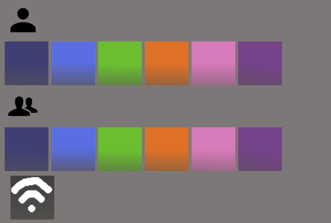
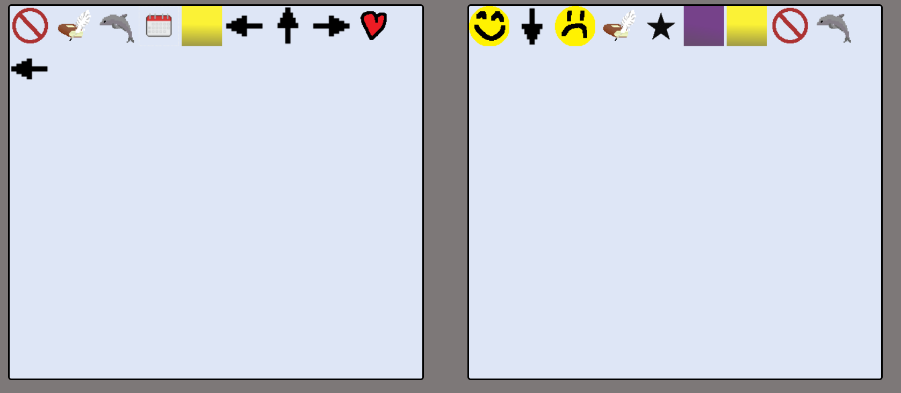

# SymbolNotes
SymbolNotes is a peer-to-peer chatroom where you can communicate using pictograms. This makes the program universal, existing beyond language and reaching into pure symbolism.

# How to use
First, you need to enter a code for yourself. To enter a code click the coloured buttons. Once you and the person you want to connect to have a code, enter their code and select the wifi button to connect to them. If done correctly, the input should disappear and a green tick should be displayed.

Now, simply type on your keyboard and have the keys be mapped to pictograms. Your display is on the left and the other user's display is on the right. The pictograms you type are automatically sent to the other user.

# Screenshots

Screenshot showing the connection interface:

Screenshot showing the main chat interface:

